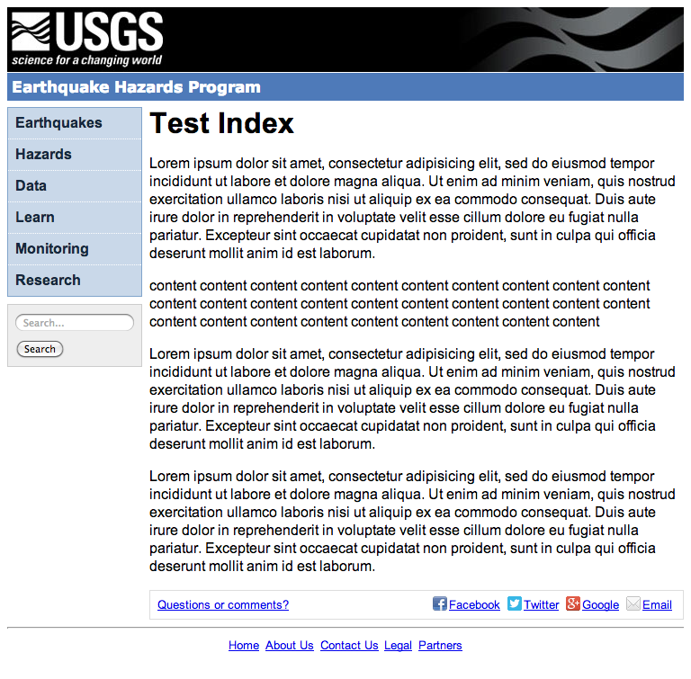
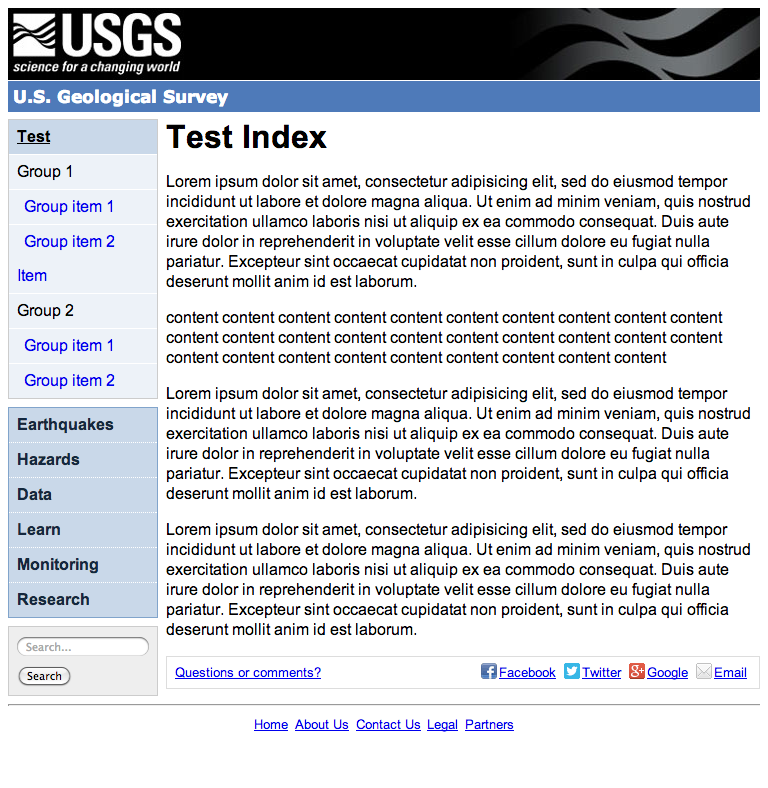
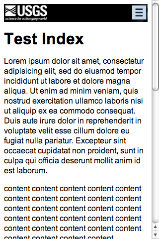
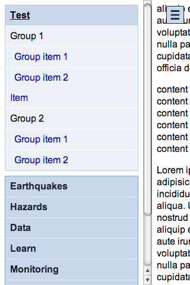
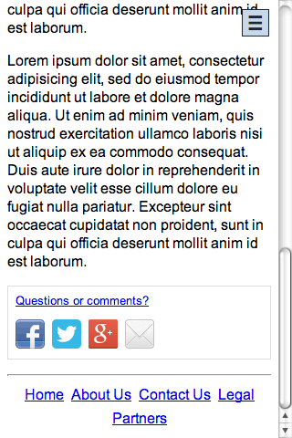

Overview
========

The screenshots shown on this page are from viewing the `example` directory in this project.

## Full size

This shows the default page layout for devices 768 pixels or wider, at 768px which is the width of an iPad in portrait mode.

### Default page

* The USGS logo, customizable banner, and site title are at the top of the page.
* The left column contains site wide navigation and search.
* Content fills the main column including page title at the top, and page contact and sharing links at the bottom.
* The page ends with links common to every page.

### With section navigation

The same page with optional section specific navigation, added to the top of the left column.

## Mobile Size

This shows portions of the same page layout for a device 320px.

### Collapsed Header

The header is collapsed and site title hidden.

### Off Canvas Side Column

The side column with navigation and search is hidden behind a toggle in the top right corner, which stays fixed (in the same place) as the page scrolls.  When activated, the side column content is revealed by moving the page to the right.

### Collapsed Footer

The page footer is also collapsed.

