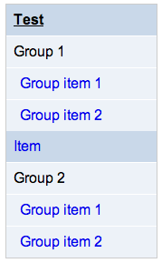
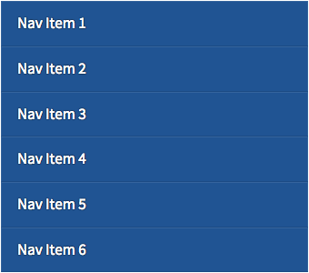

Template SCSS Variables
=======================

The most commonly configured SCSS variables are:
- [$banner-image](#banner-image)
- [$banner-background-color](#banner-background-color)
- [$banner-title](#banner-title)
- [$primary](#primary)

See [Site Configuration](siteConfiguration.md) for information about configuring these variables.

## Template Header

### $banner-image

The banner image to the right of the USGS logo.
Default is '/theme/images/usgs-banner.jpg'.

### $banner-background-color

The background color of the banner section.
Default is #000000.

### $banner-title

Name of site.
Default is 'U.S. Geological Survey'.

### $primary

Background color for [$banner-title](#banner-title).
Default is #205493.

### $primary-text-color

Text color for [$banner-title](#banner-title).
Default is #ffffff.

## Section Navigation

Section navigation is by default made to be 10% "lighter" than [site navigation](#site-navigation), and often does not need to be specified by a theme.

* "Test" shows the styles for the current page, based on $sitenav-background-color-hover.
* "Item" shows the styles when a mouse hovers over the item.

### $secondary-text-color
Text color for section navigation.
Default is #333333.

### $secondary-lighter
Background color for section navigation.
Hover text color for section navigation.
Default is #f4f4f4.

### $secondary
Border color for section navigation.
Default is #e0e0e0.

## Site Navigation

### $primary-text-color
Text color for site navigation.
Default is #ffffff.

### $primary
Background color for site navigation.
Default is #205493.

### $primary-darker
Hover background color for site navigation.
Default is #112e51.

## General Layout

### $spacing
Used as padding and margin of many elements.
Default is 1em.

### $breakpoint-stacking
Width of page when content formatted using the flexible grid starts to stack.
Default is 560px.

### $breakpoint-offcanvas
Width of page when OffCanvas is disabled.
Default is 768px.

